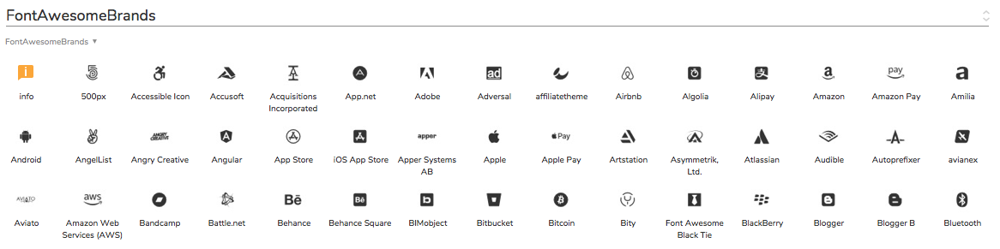
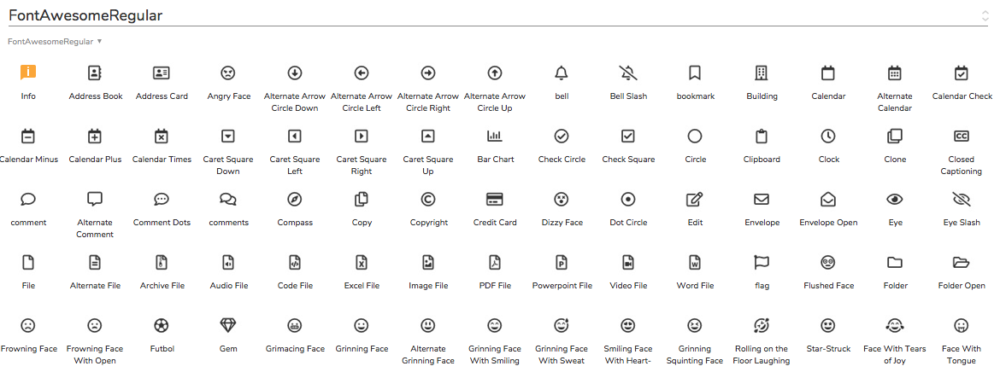

# 😁 fontawesome-axure-library-5
FontAwesome 5.8.2 for Axure 9 字体图标库。使用了免费版字体，共包含1515个图标。
根据 [FontAwesome](https://fontawesome.com/) 上的分类，共包含Solid、Regular以及Brands三款字体。相应的本组件库也分成了三个部分。

## 🎉 图标库特点
* 图标默认尺寸为44\*44，以适用于App和Web设计;
* 字号使用20号，并居中显示，适用于常见的情况；
* 所有图标均使用了字体样式，您可以通过修改字体样式来更新字体图标。

## 🛬 下载地址
* 下载 [FontAwesome字体文件](./FontAwesome_Free_5.8.2/)；
* 或 [FontAwesome字体官网](https://fontawesome.com/) 下载；
* 下载 [Axure 9 组件库.rplib](./Axure9_Library_5.8.2/)。

## 🎊 如何在 Axure 中使用此图标库
1. 下载 [FontAwesome字体](./FontAwesome_Free_5.8.2/) 并安装，下载并将对应的 [.rplib](./Axure9_Library_5.8.2/) 文件添加到 Axure；
2. 在您的原型文件中使用此字体图标库。提示：Regular版本，是有两种字重的；
3. 点击 发布 > 生成 HTML 文档, 在弹窗中点击 “Font” 字体，点击添加“+ Add Font”按钮；
4. 在 Font Lable 一栏输入字体标题，如：FontAwesome，并选中 “link to .css”；
5. 在 URL of CSS file 一栏中输入：https://cdn.staticfile.org/font-awesome/5.8.2/css/all.min.css ；
6. 添加完成后即可发布原型至Html。

## 🏄‍♂️ 示例

## 🍻 Enjoy~
祝使用愉快，如有任何问题请留言，或访问个人网站：https://www.y3pm.com
